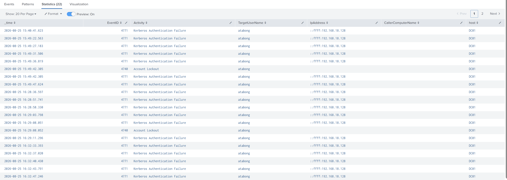

# Active Directory Account Lockout Detection & Investigation

## Objective
Simulate repeated Active Directory authentication failures, detect the resulting account lockout, and correlate the activity in Splunk.

## Lab Environment
- Windows Server 2025 Domain Controller (DC01)
- Active Directory Domain Services
- Windows 11 Enterprise (WIN11-CLIENT01)
- Splunk Enterprise
- VMware Workstation
- Windows Security Event Logs

## Scenario
Repeated incorrect domain authentication attempts were generated from WIN11-CLIENT01 against a CyberLab domain account.

The objective was to confirm that the authentication failures were logged, forwarded to Splunk, and correlated with the resulting Active Directory account lockout.

## Events Investigated

### Event ID 4771
Kerberos pre-authentication failure.

Used to identify repeated failed domain authentication attempts.

### Event ID 4740
A user account was locked out.

Used to confirm that repeated authentication failures resulted in an Active Directory account lockout.

## Investigation

Splunk identified multiple Kerberos authentication failures for the same domain account originating from the same source IP.

The failures were followed by Event ID 4740 on the Domain Controller.

Observed sequence:

1. Repeated Event ID 4771 authentication failures
2. Same target account
3. Same originating endpoint/IP
4. Event ID 4740 generated
5. Account lockout confirmed on DC01

## Splunk Correlation Search

```spl
index=* sourcetype="XmlWinEventLog:Security"
("<EventID>4771</EventID>" OR "<EventID>4740</EventID>")
"atabong"
| rex field=_raw "<EventID>(?<EventID>\d+)</EventID>"
| rex field=_raw "<Data Name='TargetUserName'>(?<TargetUserName>[^<]+)"
| rex field=_raw "<Data Name='IpAddress'>(?<IpAddress>[^<]+)"
| rex field=_raw "<Data Name='CallerComputerName'>(?<CallerComputerName>[^<]+)"
| eval Activity=case(
    EventID="4771","Kerberos Authentication Failure",
    EventID="4740","Account Lockout"
)
| table _time EventID Activity TargetUserName IpAddress CallerComputerName host
| sort _time

```

## Evidence

### Splunk Correlation: Kerberos Failures and Account Lockouts

The following evidence shows repeated Event ID 4771 authentication failures correlated with Event ID 4740 account lockouts.


