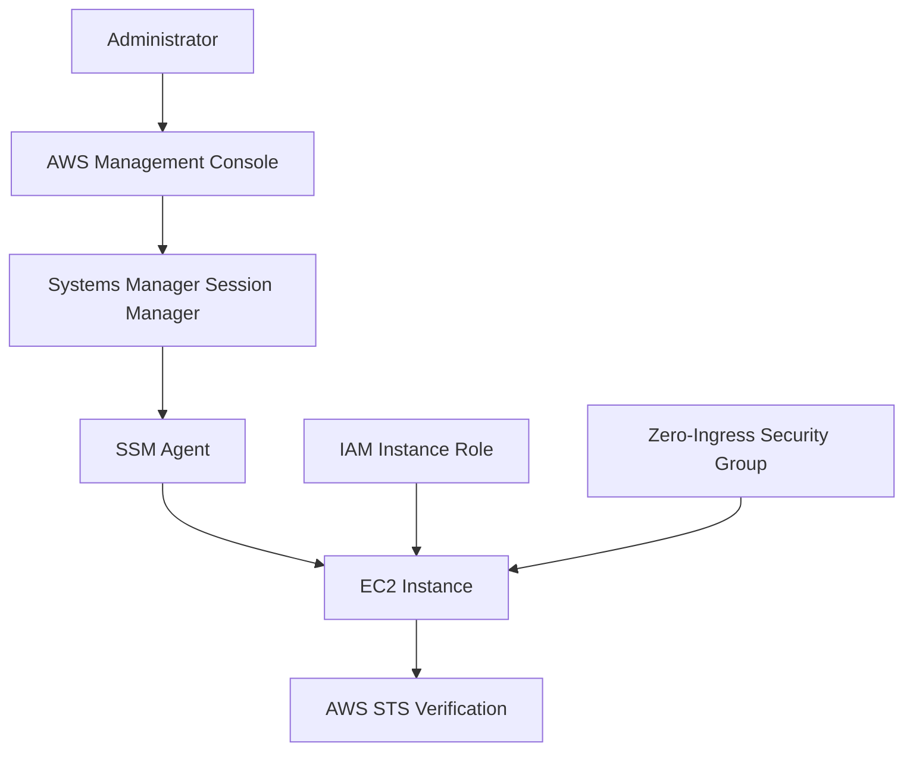
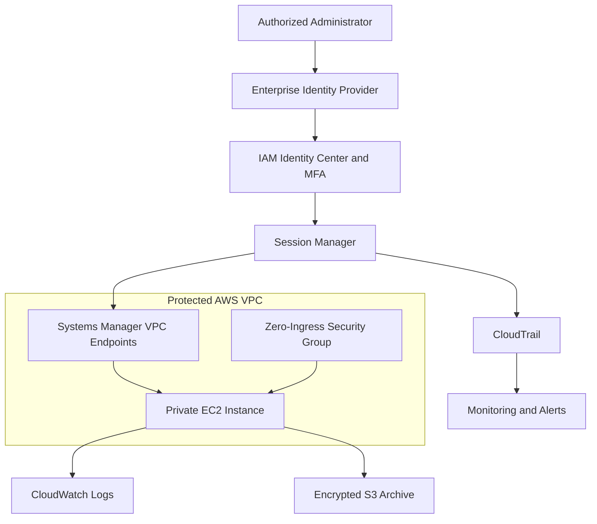

# AWS EC2 IAM and Systems Manager Hardening


## Project Overview

This project demonstrates a secure administrative-access architecture for an Amazon EC2 instance using AWS Identity and Access Management and AWS Systems Manager Session Manager.

The EC2 instance was assigned an IAM instance role, successfully registered as a managed node in Systems Manager, and accessed without opening inbound SSH or RDP ports. The instance security group contains zero inbound rules, significantly reducing exposure to port scanning, brute-force authentication attempts, stolen SSH keys, and unauthorized remote access.

The implemented laboratory environment validates the core security pattern. The documented target state extends the design with private subnets, interface VPC endpoints, centralized logging, encryption, continuous monitoring, automated patching, multi-account governance, and just-in-time administrative access.

---

## Project Objectives

The objectives of this project were to:

* Eliminate direct SSH and RDP exposure.
* Implement identity-based administrative access.
* attach an IAM role securely to an EC2 instance.
* Register and manage the instance through AWS Systems Manager.
* Verify that the instance receives credentials from the assigned IAM role.
* Apply least-privilege and Zero Trust security principles.
* Reduce the externally accessible attack surface.
* Document trust boundaries and administrative data flows.
* Map the design to recognized security frameworks.
* Identify residual risks and appropriate treatments.
* Develop an enterprise scaling strategy.

---

## Project Status

| Capability                            | Status       | Notes                                                    |
| ------------------------------------- | ------------ | -------------------------------------------------------- |
| EC2 instance deployed                 | Completed    | Instance created and operational                         |
| IAM instance role created             | Completed    | Role assigned to the EC2 service                         |
| IAM role attached to EC2              | Completed    | Instance successfully received role credentials          |
| SSM Agent connectivity                | Completed    | Managed node reported Online/Connected                   |
| Zero inbound security-group rules     | Completed    | No SSH, RDP or other inbound access permitted            |
| STS identity verification             | Completed    | `aws sts get-caller-identity` validated the assumed role |
| Session Manager administrative access | Completed    | Management performed without inbound ports               |
| Private subnet deployment             | Target state | Recommended for enterprise deployment                    |
| Systems Manager VPC endpoints         | Target state | Removes dependence on public internet or NAT access      |
| Centralized session logging           | Target state | Recommended for investigation and compliance             |
| Automated patch management            | Target state | Recommended through Patch Manager                        |
| Multi-account centralized governance  | Target state | Recommended for enterprise scale                         |
| Just-in-time privileged access        | Target state | Recommended for production environments                  |

> **Status clarification:** Items marked **Completed** were implemented or validated in the CyberLab. Items marked **Target state** represent architect-level recommendations and are not presented as completed evidence.

---

## Technologies and Services

* Amazon Elastic Compute Cloud
* AWS Identity and Access Management
* AWS Systems Manager
* Systems Manager Session Manager
* AWS Systems Manager Agent
* AWS Security Token Service
* Amazon Virtual Private Cloud
* Security groups
* AWS CloudTrail
* Amazon CloudWatch
* Amazon Simple Storage Service
* AWS Key Management Service
* AWS PrivateLink
* Amazon EventBridge
* AWS Organizations
* AWS IAM Identity Center
* AWS Systems Manager Patch Manager
* AWS Systems Manager State Manager
* AWS Systems Manager Inventory

---

## Implemented Architecture

The implemented CyberLab architecture uses an EC2 instance role and Systems Manager to provide administrative access without exposing traditional remote-management ports.



### Implemented Security Controls

* An IAM role was created with EC2 as the trusted AWS service.
* The role was attached to the EC2 instance through an instance profile.
* SSM Agent successfully communicated with AWS Systems Manager.
* The instance appeared as an Online/Connected managed node.
* The security group was configured with zero inbound rules.
* No inbound SSH connection on TCP port 22 was required.
* No inbound RDP connection on TCP port 3389 was required.
* AWS STS was used to verify the identity assumed by the instance.
* Screenshots were sanitized before publication.

---

## Target-State Architecture

The proposed enterprise target state places EC2 workloads in private subnets and uses identity-aware, API-mediated administration through Systems Manager.



### Target-State Characteristics

* EC2 instances reside in private subnets.
* Instances do not require public IP addresses.
* Administrators authenticate through the enterprise identity provider.
* MFA is required for privileged access.
* IAM policies determine who may start a session.
* Tag-based policies restrict which instances each administrator may access.
* Session Manager replaces inbound SSH and RDP administration.
* Security groups contain no administrative inbound rules.
* Systems Manager traffic uses interface VPC endpoints.
* Session activity is forwarded to centralized logging destinations.
* CloudTrail records Systems Manager and IAM API activity.
* CloudWatch and EventBridge evaluate administrative activity.
* AWS KMS customer-managed keys protect sensitive logs.
* Logs are stored in a separate security or log-archive account.
* Privileged production sessions require time-limited authorization.

---

## Security Architecture Principles

### Zero Trust

The architecture does not automatically trust a user because the user is connected to a corporate or cloud network. Each administrative session requires:

1. A verified identity.
2. Strong authentication.
3. Explicit IAM authorization.
4. Permission to access the selected instance.
5. An approved management channel.
6. Continuous logging and monitoring.

### Least Privilege

Separate policies should control:

* Who may initiate a session.
* Which instances may be accessed.
* Which Session Manager documents may be used.
* Which commands may be executed.
* Where session logs may be written.
* Who may read or delete audit records.
* Which AWS actions the EC2 workload may perform.

### Defense in Depth

The design uses several complementary security layers:

* Identity-provider authentication.
* MFA.
* IAM authorization.
* Resource-tag restrictions.
* Zero-ingress security groups.
* Private networking.
* VPC endpoint policies.
* Encrypted communication.
* Centralized logging.
* Security monitoring.
* Operating-system hardening.
* Automated patching.

### Separation of Duties

Administrative access, workload execution, security monitoring, log administration, and encryption-key management should be assigned to separate roles wherever operationally practical.

---

## Trust-Boundary Analysis

| Trust boundary             | Components                                  | Primary risk                                   | Security enforcement                                                         |
| -------------------------- | ------------------------------------------- | ---------------------------------------------- | ---------------------------------------------------------------------------- |
| User-to-AWS boundary       | Administrator and AWS identity services     | Stolen credentials or impersonation            | Federation, MFA, conditional access and short-lived sessions                 |
| Identity boundary          | IAM Identity Center, IAM roles and policies | Excessive or unauthorized privileges           | Least privilege, role separation and access reviews                          |
| AWS control-plane boundary | Systems Manager, IAM and EC2 APIs           | Unauthorized administrative actions            | IAM authorization, service control policies and CloudTrail                   |
| VPC boundary               | Private subnet and VPC endpoints            | Unintended internet exposure or network access | PrivateLink, endpoint policies, route controls and security groups           |
| Workload boundary          | SSM Agent and EC2 operating system          | Host compromise or privilege escalation        | OS hardening, patching, endpoint monitoring and restricted instance roles    |
| Metadata boundary          | EC2 Instance Metadata Service               | Credential theft from the instance role        | IMDSv2, application isolation and least-privilege role permissions           |
| Logging boundary           | CloudWatch Logs, S3 and KMS                 | Audit-log disclosure, modification or deletion | Encryption, restricted log roles, retention policies and centralized storage |
| AWS account boundary       | Workload and security accounts              | Lateral movement or governance bypass          | AWS Organizations, SCPs and dedicated security accounts                      |

---

## Administrative Access Data Flow

1. The administrator authenticates through the approved identity provider.
2. MFA verifies an additional authentication factor.
3. The administrator assumes an authorized AWS role.
4. The administrator requests a Systems Manager session with a selected EC2 instance.
5. IAM evaluates whether the identity may call `ssm:StartSession`.
6. IAM evaluates whether the requested instance and Session Manager document are authorized.
7. SSM Agent creates an outbound encrypted connection to Systems Manager.
8. Systems Manager establishes the administrative session.
9. No inbound SSH or RDP connection is opened to the instance.
10. Session metadata and applicable session activity are forwarded to the configured logging services.
11. CloudTrail records the management-plane API request.
12. Monitoring rules evaluate the event for suspicious or unauthorized activity.
13. When the session ends, termination information remains available for audit and investigation.

---

## IAM and Authorization Design

### Workload Identity

The EC2 instance uses an IAM role instead of long-term access keys stored on the operating system.

This provides:

* Temporary AWS credentials.
* Automatic credential rotation.
* Centralized permission management.
* Reduced exposure of static access keys.
* Easier revocation and auditing.

### Human Administrative Identity

In the enterprise target state, administrators should use federated, short-lived identities rather than standalone IAM users.

Recommended controls include:

* IAM Identity Center integration.
* Enterprise identity-provider federation.
* MFA enforcement.
* Role-based access control.
* Attribute-based or tag-based access control.
* Time-limited privileged roles.
* Regular access certification.
* Emergency-access procedures.

### Example Authorization Conditions

Access can be restricted using conditions such as:

* Approved EC2 resource tags.
* Administrator department or team.
* Environment classification.
* Source VPC endpoint.
* Approved Session Manager document.
* Requested AWS Region.
* MFA-authenticated session.
* Approved change or support window.

---

## Network Security Design

The instance security group contains zero inbound rules. This prevents direct network-based administrative access through SSH or RDP.

### Implemented State

* No inbound SSH rule.
* No inbound RDP rule.
* No publicly exposed administrative port.
* Systems Manager connectivity established through an outbound management path.

### Enterprise Target State

* Place the instance in a private subnet.
* Remove the public IPv4 address.
* Use Systems Manager interface VPC endpoints.
* Restrict endpoint security groups to authorized workload subnets.
* Apply restrictive endpoint policies.
* Review route tables and network ACLs.
* Use DNS resolution for AWS private service endpoints.
* Permit only required outbound traffic.
* Use egress filtering where operationally feasible.

Depending on the AWS Region and configuration, Systems Manager managed nodes may require connectivity to endpoints including:

* `ssm`
* `ssmmessages`
* `ec2messages`

Additional endpoints may be required for services such as:

* CloudWatch Logs
* Amazon S3
* AWS KMS

---

## Logging and Monitoring Architecture

The target state centralizes management-plane and session evidence for detection, investigation, and compliance.

### CloudTrail

CloudTrail should record relevant activity, including:

* Session initiation.
* Session termination.
* IAM role changes.
* Instance-profile changes.
* Security-group changes.
* Systems Manager document activity.
* Logging-configuration changes.
* KMS key-policy changes.

### Session Logging

Where supported by the selected session type and configuration, Session Manager activity should be sent to:

* Amazon CloudWatch Logs for operational monitoring.
* Amazon S3 for centralized retention and investigation.
* AWS KMS for encryption protection.

### Recommended Alerts

Create alerts for:

* Session initiation outside approved hours.
* Session initiation by an unexpected identity.
* Sessions targeting production resources.
* Repeated authorization failures.
* Unauthorized instance-profile changes.
* IAM policy changes affecting Systems Manager.
* Security-group changes that introduce SSH or RDP exposure.
* CloudTrail logging interruption.
* Session-log delivery failures.
* VPC endpoint-policy changes.
* KMS key disablement or deletion scheduling.

> Session-content logging has limitations for certain connection methods or encrypted session types. Validate the selected Session Manager configuration before claiming that all commands or keystrokes are recorded.

---

## Security and Compliance Control Mapping

This mapping shows how the project supports selected security-control objectives. It does not represent certification or complete organizational compliance.

| Framework or control                 | Control objective                               | Implementation or evidence                               | Status                     |
| ------------------------------------ | ----------------------------------------------- | -------------------------------------------------------- | -------------------------- |
| NIST SP 800-53 AC-2                  | Manage system accounts                          | IAM identities, roles and lifecycle management           | Partially implemented      |
| NIST SP 800-53 AC-3                  | Enforce authorized access                       | IAM authorization for Session Manager                    | Implemented                |
| NIST SP 800-53 AC-6                  | Enforce least privilege                         | EC2 role and restricted administrator permissions        | Implemented and expandable |
| NIST SP 800-53 IA-2                  | Identify and authenticate users                 | Federated identity and MFA                               | Target state               |
| NIST SP 800-53 AU-2                  | Define auditable events                         | Systems Manager and CloudTrail events                    | Partially implemented      |
| NIST SP 800-53 AU-3                  | Capture audit-record content                    | Session and API-event information                        | Target state               |
| NIST SP 800-53 AU-6                  | Review and analyze audit records                | CloudWatch queries, detections and alerts                | Target state               |
| NIST SP 800-53 AU-9                  | Protect audit information                       | Restricted, encrypted and centralized logs               | Target state               |
| NIST SP 800-53 CM-2                  | Maintain baseline configurations                | Hardened EC2 and Systems Manager configuration           | Partially implemented      |
| NIST SP 800-53 CM-6                  | Enforce configuration settings                  | State Manager, policies and security groups              | Target state               |
| NIST SP 800-53 IA-5                  | Manage authenticators                           | Temporary role credentials instead of stored access keys | Implemented                |
| NIST SP 800-53 SC-7                  | Protect system boundaries                       | Zero ingress, private subnets and VPC endpoints          | Partially implemented      |
| NIST SP 800-53 SC-8                  | Protect transmitted information                 | Encrypted Systems Manager service connection             | Implemented                |
| NIST SP 800-53 SI-2                  | Remediate system flaws                          | Patch Manager and maintenance windows                    | Target state               |
| NIST SP 800-207                      | Apply Zero Trust principles                     | Identity-aware, per-session authorization                | Partially aligned          |
| CIS AWS Foundations Benchmark        | Protect IAM, logging and network configurations | Least privilege, logging and restricted exposure         | Partially aligned          |
| AWS Well-Architected Security Pillar | Protect identities, infrastructure and data     | IAM, secure access, logging and risk treatment           | Partially aligned          |

---

## Risk Register

| ID   | Risk                                                                                           | Likelihood | Impact | Treatment                                                                  | Disposition              |
| ---- | ---------------------------------------------------------------------------------------------- | ---------: | -----: | -------------------------------------------------------------------------- | ------------------------ |
| R-01 | The AWS-managed instance policy may provide more permissions than a specific workload requires |     Medium |   High | Review effective permissions and create a tailored policy where practical  | Open                     |
| R-02 | The instance may use outbound internet or NAT access instead of private endpoints              |     Medium | Medium | Deploy required interface VPC endpoints                                    | Target-state remediation |
| R-03 | Session activity may not be centrally recorded                                                 |     Medium |   High | Configure encrypted CloudWatch Logs and S3 destinations                    | Open                     |
| R-04 | A compromised administrator identity could initiate an unauthorized session                    | Low/Medium |   High | Require MFA, resource-tag restrictions and just-in-time access             | Residual risk            |
| R-05 | A compromised host could attempt to misuse the instance role                                   |        Low |   High | Restrict role permissions, require IMDSv2, patch and monitor the host      | Residual risk            |
| R-06 | Administrators in the workload account could affect locally stored evidence                    |     Medium |   High | Send immutable or protected logs to a dedicated security account           | Target-state remediation |
| R-07 | The CyberLab may operate in one Availability Zone                                              |     Medium |    Low | Accept limited availability for a nonproduction demonstration              | Lab-tolerated            |
| R-08 | Some security findings require manual review                                                   |     Medium | Medium | Add EventBridge alerts and automated response workflows                    | Temporarily tolerated    |
| R-09 | Misconfigured endpoint policies could permit unintended access                                 | Low/Medium |   High | Apply least-privilege endpoint policies and test effective access          | Target-state remediation |
| R-10 | Public screenshots could expose AWS identifiers                                                |     Medium | Medium | Redact account numbers, IP addresses, ARNs, role sessions and resource IDs | Mitigated                |

### Risk-Acceptance Statement

Risks marked **Lab-tolerated** or **Temporarily tolerated** are accepted only within this nonproduction CyberLab, which contains no production data and has limited availability requirements.

In a production environment, a designated business or system owner would be required to review and formally accept residual risk. Additional technical and procedural controls would be implemented according to the organization’s risk-management process.

---

## Enterprise Scaling Recommendations

### Near-Term Improvements

* Replace manually created resources with Terraform or CloudFormation.
* Enable centralized Session Manager logging.
* Encrypt logs using AWS KMS.
* Configure CloudTrail monitoring for administrative events.
* Restrict `ssm:StartSession` using EC2 resource tags.
* Restrict the Session Manager documents administrators may invoke.
* Require IMDSv2 on all EC2 instances.
* Enable Systems Manager Inventory.
* Use Patch Manager for vulnerability remediation.
* Use State Manager to maintain configuration baselines.

### Medium-Term Improvements

* Place managed instances in private subnets.
* Remove unnecessary public IP addresses.
* Deploy the required Systems Manager VPC endpoints.
* Add endpoints for supporting services where required.
* Separate development, testing and production accounts.
* Centralize logs in a dedicated security or log-archive account.
* Apply automated configuration checks.
* Introduce approval workflows for production access.
* Use maintenance windows for controlled changes.
* Use targets and rate controls for staged fleet operations.
* Create reusable, centrally governed Systems Manager documents.

### Enterprise Target State

* Manage accounts through AWS Organizations.
* Apply service control policies across organizational units.
* Integrate workforce identities with IAM Identity Center.
* Enforce MFA and short-lived sessions.
* Implement just-in-time privileged access.
* Require approval for sensitive production sessions.
* Enforce attribute-based or tag-based access.
* Aggregate findings from Security Hub, GuardDuty and Inspector.
* Integrate CloudTrail, Systems Manager and IAM events with the enterprise SIEM.
* Automate remediation of unauthorized security-group rules.
* Automate remediation of missing or unhealthy SSM Agents.
* Monitor configuration drift across AWS accounts and Regions.
* Test incident-response and recovery procedures.
* Monitor Systems Manager quotas before large fleet deployments.
* Establish architecture standards and documented exception processes.

---

## Infrastructure-as-Code Strategy

For repeatable deployment, the target architecture should be implemented using Terraform or AWS CloudFormation.

Infrastructure as code should provision and manage:

* IAM roles and policies.
* EC2 instance profiles.
* EC2 instances or launch templates.
* Security groups.
* Private subnets and route tables.
* Interface VPC endpoints.
* Endpoint security groups.
* CloudWatch log groups.
* S3 logging buckets.
* KMS keys and key policies.
* CloudTrail configuration.
* EventBridge detection rules.
* Systems Manager associations.
* Patch baselines.
* Maintenance windows.
* Required resource tags.

### Recommended Deployment Controls

* Store infrastructure code in version control.
* Require peer review before deployment.
* Scan templates for security misconfigurations.
* Validate IAM policies before deployment.
* Separate development and production state.
* Detect configuration drift.
* Protect deployment roles with least privilege.
* Record changes through the CI/CD pipeline.

---

## Validation Procedures

### 1. Confirm the Instance Role

Verify that the correct IAM role is attached to the EC2 instance.

Expected result:

* An instance profile is displayed.
* The role trust policy allows EC2 to assume the role.
* No long-term access keys are stored on the instance.

### 2. Confirm Systems Manager Connectivity

Open the Systems Manager managed-node inventory.

Expected result:

* The EC2 instance appears as a managed node.
* Connection status is Online or Connected.
* Agent information is visible.

### 3. Confirm Zero Inbound Access

Review the security group attached to the instance.

Expected result:

* Zero inbound rules are present.
* TCP port 22 is not exposed.
* TCP port 3389 is not exposed.
* No administrative port is publicly reachable.

### 4. Verify the Instance Identity

From the managed instance, run:

```bash
aws sts get-caller-identity
```

Expected result:

* AWS STS returns the assumed-role identity.
* The returned identity corresponds to the EC2 instance role.
* The instance does not rely on locally stored long-term credentials.

### 5. Validate Session Manager Access

Start an approved Systems Manager session.

Expected result:

* Administrative access succeeds.
* No inbound security-group rule is added.
* No SSH private key or RDP exposure is required.

### 6. Validate Audit Events

Review applicable CloudTrail event history.

Expected result:

* Session initiation is associated with the correct administrator.
* The target resource can be identified.
* Session termination or related management activity is recorded.
* No sensitive identifiers are exposed in public evidence.

---

## Security Testing Performed

The following conditions were validated:

* The EC2 instance successfully assumed the assigned IAM role.
* AWS STS returned the expected assumed-role identity.
* SSM Agent successfully connected to Systems Manager.
* The instance appeared as an Online/Connected managed node.
* Administrative access did not depend on inbound SSH.
* The security group contained zero inbound rules.
* Long-term AWS access keys were not required on the instance.
* Sensitive identifiers were redacted from portfolio evidence.

---

## Threats Addressed

| Threat                                    | Mitigation                                                                 |
| ----------------------------------------- | -------------------------------------------------------------------------- |
| Internet-based SSH scanning               | No inbound SSH rule                                                        |
| RDP brute-force attacks                   | No inbound RDP rule                                                        |
| Stolen SSH private keys                   | Session Manager eliminates the SSH-key requirement for this access pattern |
| Static AWS credential exposure            | EC2 role provides temporary credentials                                    |
| Unauthorized administrative access        | IAM evaluates each session request                                         |
| Excessive network trust                   | Identity-based authorization replaces reliance on network location         |
| Unattributed administrative activity      | CloudTrail and session metadata support accountability                     |
| Lateral movement through management ports | Administrative ports are not exposed                                       |
| Unauthorized configuration changes        | Centralized logging and monitoring support detection                       |
| Credential persistence                    | Temporary role credentials rotate automatically                            |

---

## Evidence

> All screenshots should be reviewed and sanitized before publication.

### 1. IAM Role Created and Attached


**Demonstrates:**

* Creation of an IAM role for the EC2 service.
* Use of an instance profile.
* Assignment of workload permissions without embedding access keys.

### 2. Systems Manager Managed Node Online


**Demonstrates:**

* SSM Agent connectivity.
* Successful registration as a managed node.
* Centralized management readiness.

### 3. Security Group with Zero Inbound Rules


**Demonstrates:**

* Elimination of inbound SSH and RDP exposure.
* Reduced external attack surface.
* Support for a Zero Trust administrative-access model.

### 4. AWS STS Identity Verification


**Demonstrates:**

* Successful assumption of the EC2 instance role.
* Use of temporary role-based credentials.
* Validation of the workload identity.

### Optional Future Evidence

Add these screenshots only after the capabilities have been implemented and validated:

* `05-session-manager-access.png`
* `06-cloudtrail-session-event.png`
* `07-session-log-cloudwatch.png`
* `08-ssm-vpc-endpoints.png`
* `09-patch-manager-compliance.png`
* `10-eventbridge-security-alert.png`

---

## Information-Handling Requirements

The public portfolio must not expose:

* AWS account numbers.
* Public or private IP addresses.
* Complete Amazon Resource Names.
* EC2 instance IDs.
* VPC and subnet IDs.
* Security-group IDs.
* Role session names.
* Usernames or email addresses.
* Access keys or security tokens.
* Organization identifiers.
* Sensitive CloudTrail event details.

Only sanitized evidence should be committed to the repository.

---

## Challenges and Resolutions

### Challenge 1: Establishing Systems Manager Connectivity

**Challenge:** The EC2 instance needed a valid workload identity and a functioning SSM Agent before it could become a managed node.

**Resolution:** An IAM role was created for EC2, attached through an instance profile, and validated after the instance reported as Online/Connected.

### Challenge 2: Removing Traditional Administrative Ports

**Challenge:** Standard EC2 administration frequently depends on inbound SSH or RDP access.

**Resolution:** Systems Manager Session Manager was used as the management path, allowing the security group to remain configured with zero inbound rules.

### Challenge 3: Verifying the Effective AWS Identity

**Challenge:** Attaching a role does not by itself prove that the instance is using the intended identity.

**Resolution:** AWS STS was queried from the instance to confirm the effective assumed-role identity.

### Challenge 4: Publishing Evidence Safely

**Challenge:** AWS console screenshots and command output can reveal account and resource identifiers.

**Resolution:** Account numbers, session identifiers, resource IDs, IP addresses and other sensitive values were redacted before publication.

---

## Lessons Learned

* Secure EC2 administration does not require publicly exposed SSH or RDP ports.
* An IAM instance role is safer than storing long-term AWS credentials on a server.
* Systems Manager provides an identity-aware management channel.
* Security-group hardening substantially reduces the network attack surface.
* Private connectivity and centralized logging are essential for an enterprise-grade implementation.
* Technical configuration should be accompanied by trust-boundary analysis, control mapping and risk documentation.
* Architecture documentation must clearly separate implemented controls from future-state recommendations.
* A successful laboratory test demonstrates a security pattern but does not by itself establish regulatory compliance.

---

## Architecture Decisions

| Decision                | Selected approach                     | Rationale                                                      | Tradeoff                                                |
| ----------------------- | ------------------------------------- | -------------------------------------------------------------- | ------------------------------------------------------- |
| Administrative access   | Systems Manager Session Manager       | Removes direct SSH/RDP exposure and supports IAM authorization | Depends on AWS control-plane and SSM Agent availability |
| Workload credentials    | IAM instance role                     | Provides temporary credentials and avoids embedded access keys | Misconfigured role permissions can still create risk    |
| Network exposure        | Zero inbound administrative rules     | Reduces scanning and brute-force opportunities                 | Requires a functioning out-of-band management path      |
| Enterprise connectivity | Interface VPC endpoints               | Keeps Systems Manager traffic on the AWS network               | Adds endpoint cost and operational complexity           |
| Logging                 | Centralized CloudWatch and S3 logging | Improves investigation, monitoring and retention               | Requires secure log design and lifecycle management     |
| Access model            | Federated and time-limited roles      | Strengthens identity governance                                | Requires integration with enterprise identity systems   |
| Deployment model        | Infrastructure as code                | Improves consistency, reviewability and scalability            | Requires code governance and pipeline controls          |

---

## Project Outcome

The project successfully demonstrated secure management of an EC2 instance through AWS Systems Manager without exposing inbound administrative ports.

The implemented configuration achieved the following outcomes:

* Established an IAM workload identity for EC2.
* Confirmed SSM Agent connectivity.
* Enabled centralized Systems Manager administration.
* Maintained zero inbound security-group rules.
* Verified the effective assumed-role identity through AWS STS.
* Reduced dependence on SSH keys and direct network access.
* Produced sanitized technical evidence for recruiter review.

The documented target state expands the laboratory implementation into a scalable security architecture with private connectivity, centralized logging, compliance-control mapping, risk management, automated patching and multi-account governance.

---

## Skills Demonstrated

* AWS cloud security architecture
* Amazon EC2 security
* AWS IAM role design
* Workload identity management
* AWS Systems Manager administration
* Zero Trust architecture
* Least-privilege access control
* Network attack-surface reduction
* Trust-boundary analysis
* Security data-flow documentation
* NIST SP 800-53 control mapping
* Risk identification and treatment
* Security logging and monitoring
* Enterprise cloud-governance planning
* Infrastructure-as-code strategy
* Technical evidence sanitization

---

## Recruiter Summary

This project demonstrates the ability to design and validate an identity-aware AWS administrative-access pattern using EC2 IAM roles and Systems Manager Session Manager. The implemented environment eliminates inbound SSH and RDP exposure, uses temporary workload credentials, and validates access through AWS STS.

The accompanying target-state architecture demonstrates additional capabilities in Zero Trust design, trust-boundary analysis, secure data flows, NIST control mapping, risk treatment, centralized monitoring, private connectivity, infrastructure as code and enterprise scalability.

---

## References

* [AWS Systems Manager documentation](https://docs.aws.amazon.com/systems-manager/)
* [AWS Systems Manager Session Manager](https://docs.aws.amazon.com/systems-manager/latest/userguide/session-manager.html)
* [Connecting to EC2 with Session Manager](https://docs.aws.amazon.com/AWSEC2/latest/UserGuide/connect-with-systems-manager-session-manager.html)
* [Systems Manager VPC endpoint guidance](https://docs.aws.amazon.com/systems-manager/latest/userguide/setup-create-vpc.html)
* [AWS Systems Manager best practices](https://docs.aws.amazon.com/systems-manager/latest/userguide/systems-manager-best-practices.html)
* [AWS IAM documentation](https://docs.aws.amazon.com/iam/)
* [AWS Security Token Service documentation](https://docs.aws.amazon.com/STS/latest/APIReference/welcome.html)
* [NIST SP 800-53 Revision 5](https://csrc.nist.gov/pubs/sp/800/53/r5/upd1/final)
* [NIST SP 800-207 Zero Trust Architecture](https://csrc.nist.gov/pubs/sp/800/207/final)
* [AWS Well-Architected Security Pillar](https://docs.aws.amazon.com/wellarchitected/latest/security-pillar/welcome.html)

---

## Disclaimer

This project was completed in a controlled, nonproduction CyberLab environment for educational and portfolio-demonstration purposes. The control mappings identify security objectives supported by the design and do not claim certification, authorization, or complete compliance with any framework.
