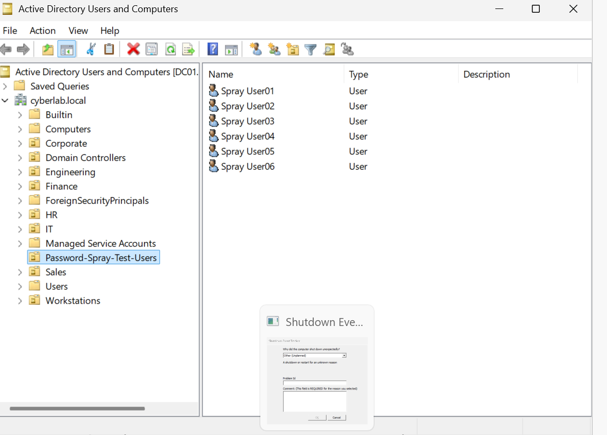
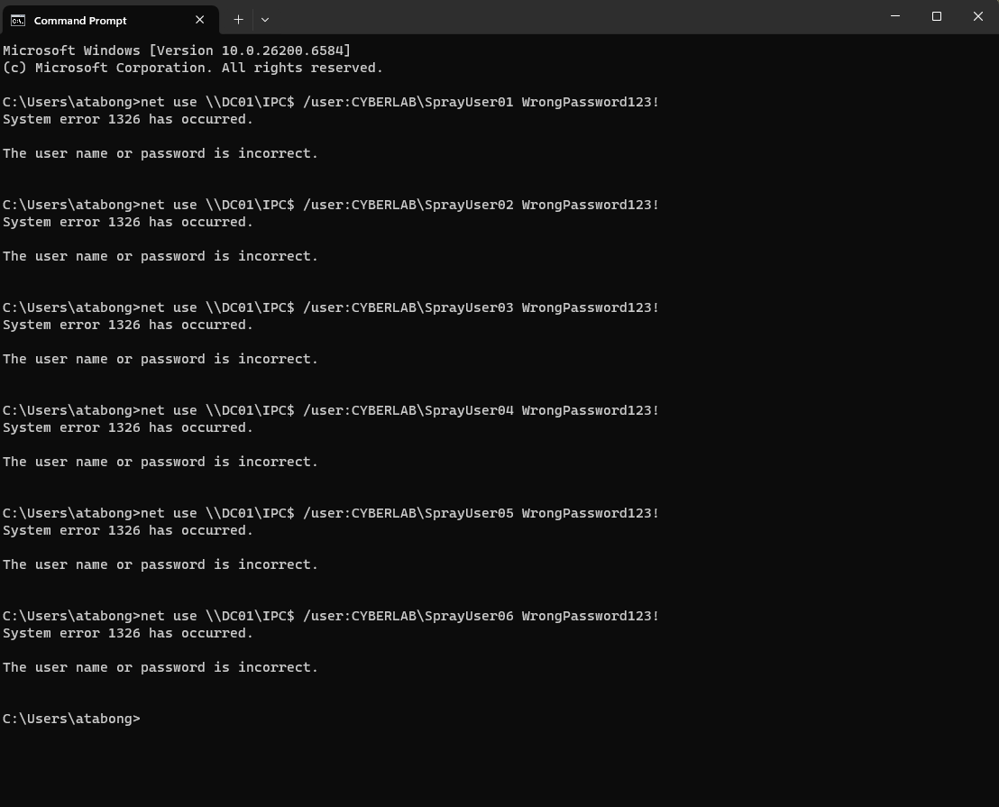
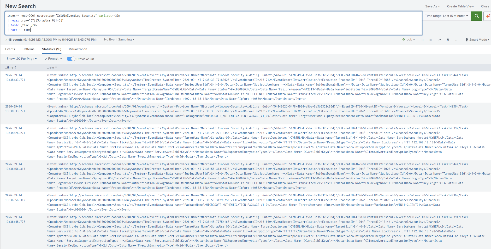
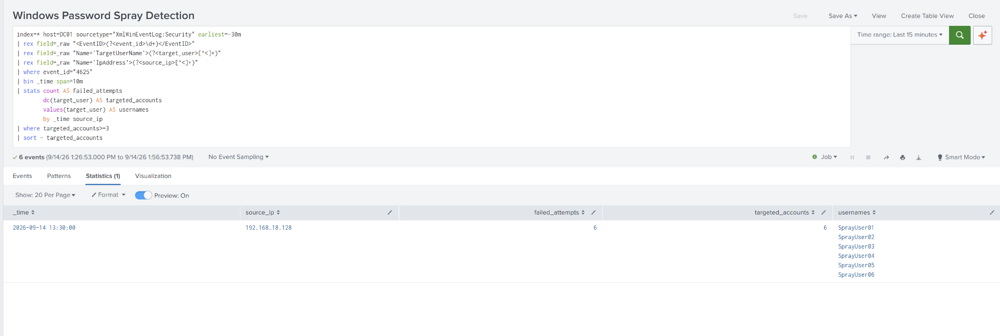
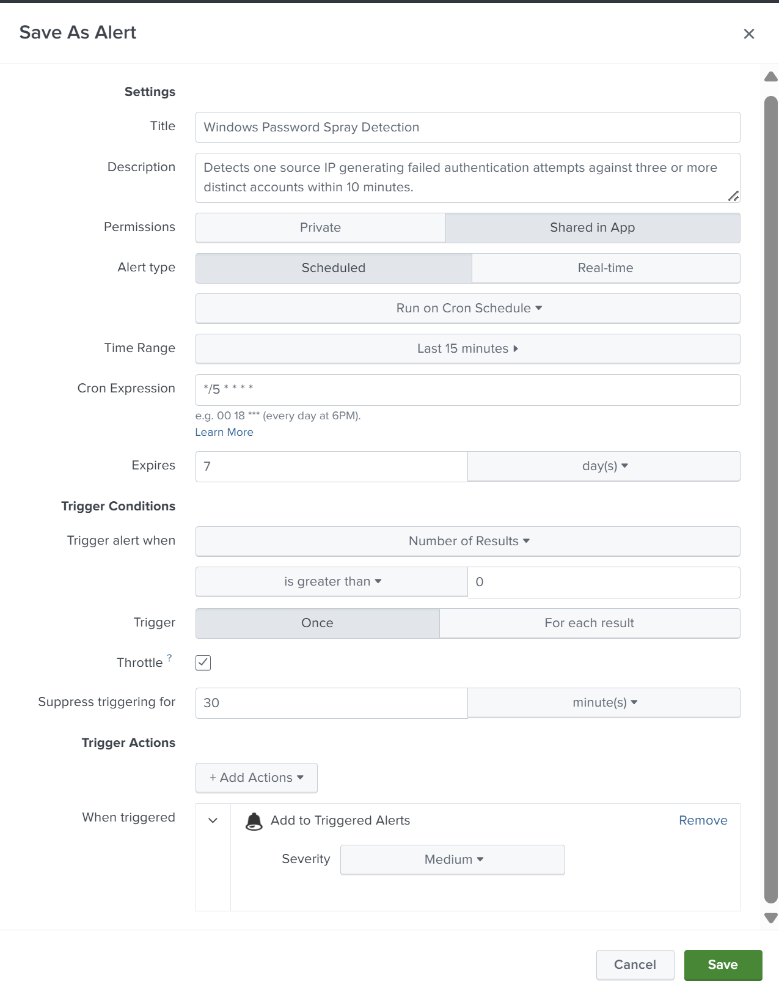
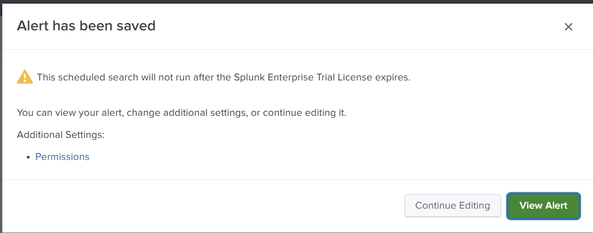

# Windows Active Directory Password Spray Detection with Splunk

## Project Overview

This project demonstrates the end-to-end detection of a password-spraying attack against Microsoft Active Directory.

A controlled password spray was simulated from a Windows 11 workstation against six authorized CyberLab test accounts. Windows Security Event ID **4625** events were generated on the domain controller, forwarded to Splunk, analyzed using XML field extraction and SPL correlation, and operationalized as a scheduled high-severity alert.

The detection successfully identified:

- One source IP performing failed authentication attempts
- Six failed authentication attempts
- Six distinct Active Directory accounts targeted
- All attempts occurring within a 10-minute detection window

> **Environment:** This activity was performed exclusively in an isolated and authorized CyberLab.

---

## Project Objectives

- Simulate password spraying safely in an isolated Active Directory environment
- Generate Windows failed-authentication events
- Verify ingestion of domain-controller security logs into Splunk
- Extract authentication fields from raw Windows XML events
- Correlate failed attempts by source IP and distinct usernames
- Distinguish password spraying from single-account brute-force activity
- Create a reusable scheduled Splunk alert
- Map the detection to the MITRE ATT&CK framework

---

## Lab Architecture

| Component | Role |
|---|---|
| DC01 | Active Directory domain controller and authentication-event source |
| WIN11-CLIENT01 | Controlled source workstation used for attack simulation |
| Splunk Enterprise | Centralized log collection, investigation, correlation, and alerting |
| Splunk Universal Forwarder | Forwarded Windows Security events from DC01 |
| CYBERLAB.LOCAL | Isolated Active Directory lab domain |
| Password-Spray-Test-Users OU | Dedicated organizational unit containing authorized test accounts |

### Test Accounts

The following dedicated accounts were created for controlled testing:

- SprayUser01
- SprayUser02
- SprayUser03
- SprayUser04
- SprayUser05
- SprayUser06



---

## Threat Scenario

Password spraying is a credential-access technique in which one password, or a small set of common passwords, is attempted against multiple accounts.

Unlike traditional brute-force attacks that repeatedly target one account, password spraying distributes authentication failures across several accounts. This may help an attacker avoid account-lockout thresholds and basic detections based only on repeated failures against one username.

### Detection hypothesis

> If one source IP produces failed authentication attempts against three or more distinct accounts within 10 minutes, the activity may represent password spraying and should generate an alert for investigation.

---

## Attack Simulation

From `WIN11-CLIENT01`, one deliberately incorrect password was submitted against each authorized test account through the administrative IPC share on `DC01`.

```cmd
net use \\DC01\IPC$ /user:CYBERLAB\SprayUser01 WrongPassword123!
net use \\DC01\IPC$ /user:CYBERLAB\SprayUser02 WrongPassword123!
net use \\DC01\IPC$ /user:CYBERLAB\SprayUser03 WrongPassword123!
net use \\DC01\IPC$ /user:CYBERLAB\SprayUser04 WrongPassword123!
net use \\DC01\IPC$ /user:CYBERLAB\SprayUser05 WrongPassword123!
net use \\DC01\IPC$ /user:CYBERLAB\SprayUser06 WrongPassword123!
```

Each request returned Windows **System error 1326**, confirming that authentication failed because the username or password was incorrect.

Only one attempt was made against each account to reproduce the distributed pattern associated with password spraying while reducing the risk of account lockout.



---

## Windows Security Telemetry

The failed network-authentication attempts generated Windows Security Event ID **4625** on `DC01`.

### Relevant event fields

| Field | Purpose |
|---|---|
| Event ID | Identifies failed Windows logon activity |
| TargetUserName | Account against which authentication was attempted |
| TargetDomainName | Domain associated with the target account |
| WorkstationName | Workstation associated with the request |
| IpAddress | Network source of the authentication attempt |
| LogonType | Indicates the type of Windows logon |
| FailureReason | Describes why authentication failed |
| Status/SubStatus | Provides detailed Windows failure codes |

### Observed event details

| Attribute | Observed value |
|---|---|
| Event ID | 4625 |
| Domain controller | DC01 |
| Target domain | CYBERLAB |
| Source workstation | WIN11-CLIENT01 |
| Source IP | 192.168.18.128 |
| Logon type | 3 — Network logon |
| Target accounts | SprayUser01 through SprayUser06 |
| Failure reason | Incorrect username or password |



---

## Field-Extraction Challenge

The historical Windows events exposed normalized fields such as `EventCode`, `Account_Name`, and `Source_Network_Address`. However, the newly ingested `XmlWinEventLog:Security` events did not consistently populate `EventCode` or `EventID` as searchable fields.

The raw XML still contained the required information:

- `<EventID>4625</EventID>`
- `TargetUserName`
- `IpAddress`

Splunk's `rex` command was therefore used to extract the required values directly from `_raw`.

This made the detection independent of the missing automatic field extractions.

---

## Final Splunk Detection

```spl
index=* host=DC01 sourcetype="XmlWinEventLog:Security" earliest=-15m
| rex field=_raw "<EventID>(?<event_id>\d+)</EventID>"
| rex field=_raw "Name='TargetUserName'>(?<target_user>[^<]+)"
| rex field=_raw "Name='IpAddress'>(?<source_ip>[^<]+)"
| where event_id="4625"
| bin _time span=10m
| stats count AS failed_attempts
        dc(target_user) AS targeted_accounts
        values(target_user) AS usernames
        by _time source_ip
| where targeted_accounts>=3
| sort - targeted_accounts
```

### Search logic

1. Searches recent Windows Security events received from `DC01`.
2. Extracts the event ID from the raw XML.
3. Extracts the target username.
4. Extracts the source IP address.
5. Retains only failed-logon Event ID 4625 activity.
6. Groups events into 10-minute time windows.
7. Counts total authentication failures.
8. Counts distinct accounts targeted by each source IP.
9. Lists all usernames associated with the source.
10. Returns activity involving at least three distinct accounts.

---

## Detection Results

The correlation search successfully detected the simulated password spray.

| Detection field | Result |
|---|---|
| Source IP | 192.168.18.128 |
| Failed attempts | 6 |
| Distinct targeted accounts | 6 |
| Detection threshold | 3 or more accounts |
| Detection window | 10 minutes |
| Target accounts | SprayUser01–SprayUser06 |
| Detection outcome | Password-spray condition satisfied |



---

## Alert Configuration

The validated SPL search was operationalized as a scheduled Splunk alert.

| Setting | Configuration |
|---|---|
| Alert name | Windows Password Spray Detection |
| Permissions | Shared in App |
| Alert type | Scheduled |
| Schedule | Every 5 minutes |
| Cron expression | `*/5 * * * *` |
| Search time range | Last 15 minutes |
| Trigger condition | Number of results greater than 0 |
| Trigger mode | Once |
| Throttling | 30 minutes |
| Severity | High |
| Alert action | Add to Triggered Alerts |
| Triggered-alert retention | 7 days |

Alert throttling reduces repeated notifications for the same continuing activity while preserving visibility of the initial detection.





---

## Investigation Workflow

When this alert triggers, a security analyst should:

1. Confirm the source IP and associated workstation.
2. Review the number of failed attempts and distinct accounts.
3. Verify whether the usernames belong to valid Active Directory accounts.
4. Determine whether a successful logon followed the failures.
5. Search for Event ID 4624 activity involving the same source or accounts.
6. Review Event ID 4740 for account lockouts.
7. Check the workstation for suspicious processes, scripts, or remote-access activity.
8. Review additional authentication telemetry from VPN, identity, firewall, and endpoint systems.
9. Determine whether the activity was authorized testing, user error, or malicious behavior.
10. Escalate and contain the affected source when malicious activity is confirmed.

### Example follow-up search for successful logons

```spl
index=* host=DC01 sourcetype="XmlWinEventLog:Security" earliest=-30m
| rex field=_raw "<EventID>(?<event_id>\d+)</EventID>"
| rex field=_raw "Name='TargetUserName'>(?<target_user>[^<]+)"
| rex field=_raw "Name='IpAddress'>(?<source_ip>[^<]+)"
| where event_id="4624"
| table _time target_user source_ip
| sort - _time
```

---

## Recommended Response Actions

If the activity is confirmed as malicious:

- Isolate the source workstation
- Disable or protect compromised accounts
- Reset affected credentials
- Revoke active sessions and authentication tokens
- Require multifactor authentication where available
- Review account-lockout and password policies
- Block malicious external source addresses when applicable
- Hunt for successful authentication following the spray
- Review endpoint telemetry for credential-access tooling
- Preserve relevant logs and investigation evidence
- Document the incident and detection improvements

---

## MITRE ATT&CK Mapping

| MITRE ATT&CK item | Mapping |
|---|---|
| Tactic | Credential Access |
| Technique | Brute Force |
| Sub-technique | T1110.003 — Password Spraying |
| Data source | Identity Provider and Windows authentication logs |
| Primary event | Windows Security Event ID 4625 |

Reference: [MITRE ATT&CK T1110.003 — Password Spraying](https://attack.mitre.org/techniques/T1110/003/)

---

## False-Positive Considerations

Potential legitimate explanations include:

- A user attempting an outdated password across multiple accounts
- A service or scheduled task with invalid stored credentials
- A shared workstation using obsolete credentials
- A vulnerability scanner or approved security assessment
- An application attempting authentication through multiple service accounts
- Misconfigured identity synchronization or automation

Useful tuning options include:

- Excluding approved vulnerability scanners
- Maintaining an allowlist of authorized administrative systems
- Increasing the distinct-account threshold in large environments
- Separating internal and external source addresses
- Correlating failures with successful logons
- Applying different thresholds to privileged accounts
- Enriching results with asset and identity context

---

## Skills Demonstrated

- Active Directory administration
- Windows Security Event monitoring
- Splunk Enterprise
- Splunk Search Processing Language
- Raw XML field extraction
- Authentication-log analysis
- Detection engineering
- Alert development and tuning
- Credential-attack investigation
- MITRE ATT&CK mapping
- Security monitoring and incident-response analysis
- Technical documentation

---

## Challenges and Lessons Learned

### Challenge: Empty detection results

The original search relied on normalized fields that were not populated for the newest XML events. Although Splunk was receiving current Security logs, searches based only on `EventCode=4625` returned no recent results.

### Resolution

A broad search for the controlled test usernames confirmed that the events were present. Inspection of `_raw` showed that the required values were stored inside the XML. Regular-expression field extraction was then added to the SPL detection.

### Lessons learned

- Zero search results do not always mean telemetry is missing.
- Raw-event inspection is essential when expected fields are empty.
- Field names may vary by Windows input format and Splunk configuration.
- Detection logic should be validated with controlled test activity.
- Password-spray detection requires distinct-account counting, not only total failures.
- Alert thresholds and suppression settings must balance visibility and alert fatigue.

---

## Project Outcome

This project successfully demonstrated the complete detection-engineering lifecycle:

1. Defined a password-spray detection hypothesis.
2. Created dedicated Active Directory test accounts.
3. Generated controlled failed-authentication activity.
4. Confirmed Windows Security Event ID 4625 telemetry.
5. Verified log ingestion into Splunk.
6. Diagnosed and corrected an XML field-extraction issue.
7. Correlated activity by time, source IP, and distinct accounts.
8. Validated the detection against six targeted accounts.
9. Converted the search into a scheduled high-severity alert.
10. Documented investigation, response, tuning, and evidence.

---

## Resume-Ready Accomplishment

> Engineered and validated a Splunk password-spray detection using Windows Security Event ID 4625, XML field extraction, and source-IP correlation, identifying six targeted Active Directory accounts within a 10-minute window and operationalizing a scheduled high-severity alert.

---

## Ethical Use Statement

All attack simulations were performed against dedicated test accounts in an isolated and authorized CyberLab. No production systems, third-party accounts, or unauthorized infrastructure were targeted.
